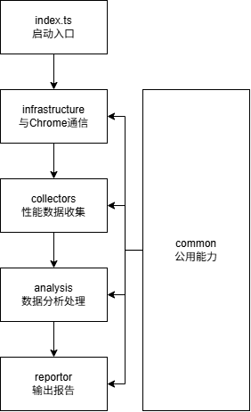

# Perf Doctor

## 系统架构

- index.ts：启动应用，依赖 perf-doctor-infrastructure 模块，负责与 Chrome 浏览器建立通信。
- perf-doctor-infrastructure：提供底层通信能力，负责与浏览器的数据交互。
- perf-doctor-collectors：收集从 Chrome 获取的性能数据。
- perf-doctor-analysis：对收集到的数据进行分析和处理。
- perf-doctor-reportor：整理分析结果并输出报告。
- perf-doctor-common: 提供上述流程中的公用能力。

